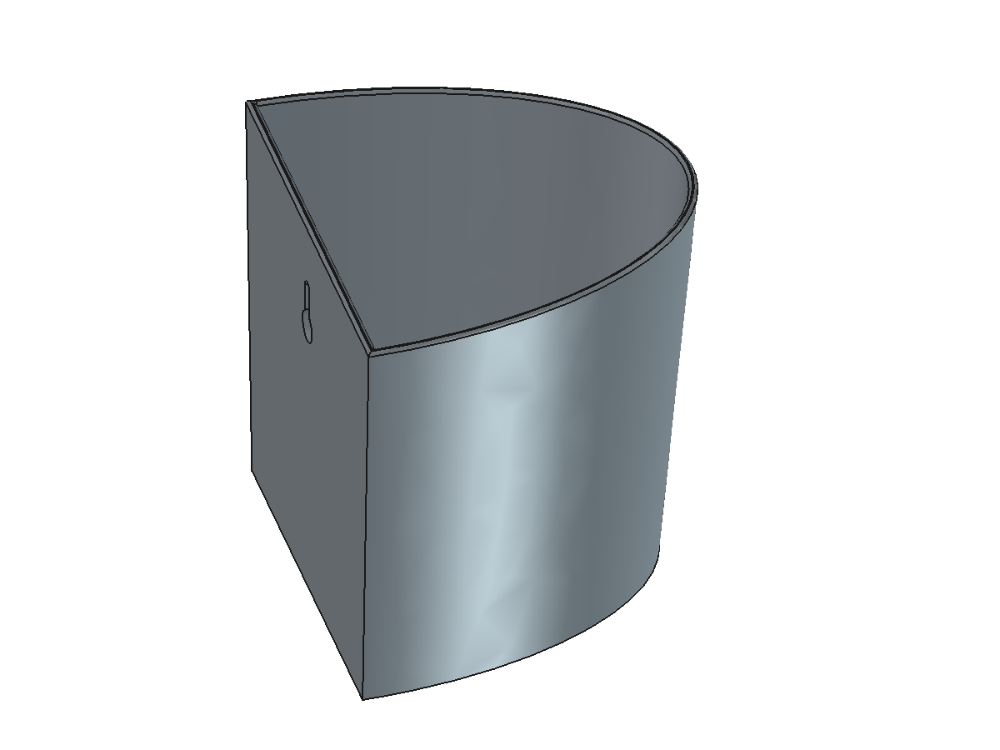

# Fake Green Planter (壁掛けフェイクグリーン用プランター)

ミドリエデザイン easy pot シリーズ(壁掛け底面給水ポット)を参考にした、
フェイクグリーン用の壁掛けプランター。給水機能を省略し、
一体シェル+キーホールスロットのシンプル構造とした。

## 仕様

| 項目 | 値 |
|---|---|
| 全体 | 幅120 × 高さ115 × 奥行き105mm、D字(半楕円)断面 |
| テーパー | 底面90%スケール(約3°)、上縁フィレットR1.0 |
| 壁厚 | 2.4mm、底閉塞(水抜き穴なし) |
| キーホール | φ9大径部 / スロット幅4.5 × 長さ12mm、上縁から20mm、ボス厚4mm(外側ウェブ2mm+ヘッドチャネル) |
| 内底リブ | 十字 60 × 2 × 高さ15mm(フェイクグリーンのフォーム/茎固定用) |

## 印刷(Bambu Lab A1)

- 向き: **直立(底面接地)のまま**。回転不要、サポート不要
- 白PLA、ウォール2〜3ループ、インフィル10〜15%
- キーホール上部とボス下端(1.6mm)は小ブリッジのみで自己支持

## 設計メモ

- 給水しない前提のため防水設計は不要(内外二重構造・ウィックを省略)
- キーホール寸法は絶対値(スケール変更時も維持すること)
- 壁厚2.4mmに対しフィレットR2は形状不成立。R1.0が実質上限

## 技術メモ(FreeCAD)

- **ロフトの対応ずれに注意**: 別々に構築した半楕円ワイヤ同士を
  `Part.makeLoft` すると対応点がずれ、前面がY=117.6mmまで
  オーバーシュートした(ruled指定でも解消せず)。
  **上面プロファイルの縮小コピー(`transformGeometry`によるスケール、
  同一トポロジ)をロフトする**ことで解決
- 半楕円プロファイルは `Part.ArcOfEllipse` + 閉じ線で構築し、
  背面のブーリアンカットを回避
- STL出力: `MeshPart.meshFromShape(LinearDeflection=0.05,
  AngularDeflection=0.3, Relative=False)`

## ファイル

- `fake_green_planter.FCStd` — FreeCADソースモデル
- `fake_green_planter.stl` — 印刷用メッシュ(直立向き)
