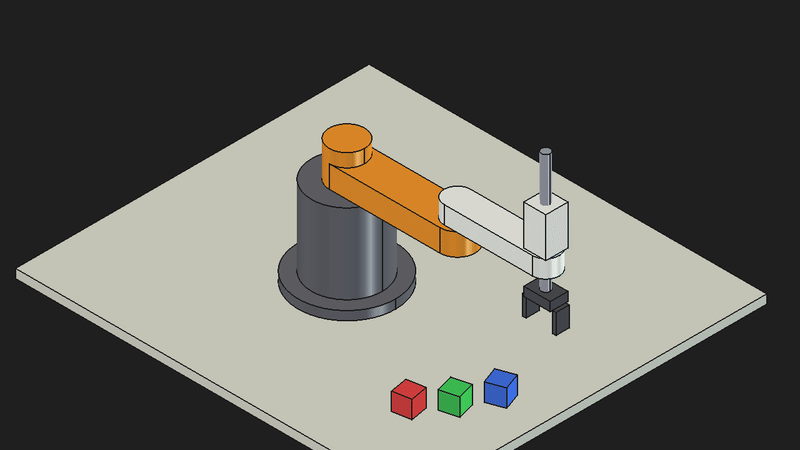

# SCARA v2 — ピック＆プレース アニメーション（実寸4軸）

FreeCAD + freecad-mcp + Claude Desktop で、実寸相当の4軸SCARAロボットをモデリングし、
立方体3個を順次把持して積み上げるピック＆プレース動作を動画化した事例。
モデリングに入る前に設計相談で仕様を固め、①モデル → ②姿勢確認 → ③テストレンダー → ④本番レンダー の順に確認しながら進めた。



| ファイル | 内容 |
|---|---|
| `SCARA_v2.FCStd` | FreeCADプロジェクト（各パーツは個別の `Part::Feature`） |
| `scara_anim.py` | 順運動学・キーフレーム・補間・レンダー関数 |
| `scara_pick_place.mp4` / `.gif` | アイソメ視点（30fps・1280×720・19.3秒） |
| `scara_pick_place_top.mp4` / `.gif` | 真上視点 |
| `scara_v2_assembly_home.step` | ホーム姿勢のアセンブリ（立方体含む） |
| `scara_v2_robot_home.stl` | ロボット本体のみ（ホーム姿勢） |

> 連番PNG（`frames*/`）は再生成できるため `.gitignore` で除外している。

## プロンプト（要約）

```
スカラ型ロボットのアニメーションを作りたい．
→ 新規／標準的な4軸／実寸／ピック&プレース／スクリーンショット連番→動画。まずはモデルを書かず相談を続けたい
→ 逆運動学は不要。3つの立方体を順次把持して積み上げるアニメーション
→ 進めて（各段階ごと）
→ ファイル名を変えて，真上から見た動画を作って
```

## 仕様

| 項目 | 値 |
|---|---|
| ベース | φ160 フランジ + φ160 円柱、高さ 200 mm |
| 第1アーム (J1) | 長さ 250 mm、幅 80、厚 50 mm |
| 第2アーム (J2) | 長さ 200 mm、幅 60、厚 40 mm。先端にZ軸ハウジング 50×50×90 |
| Z軸 (J3) | φ20 シャフト、ストローク 150 mm |
| 手首 (J4) | 先端回転。2本爪グリッパ（開時内寸 60 → 閉時 40 mm） |
| ワーク | 40 mm 角の立方体 × 3（赤・緑・青） |
| テーブル | 900 × 800 × 20 mm |

## 設計上のポイント

### IK を使わず「関節角 → FK でワーク位置を決める」

逆運動学（IK）を実装する代わりに、ピック／プレースの関節角を先に決め、
その関節角での先端座標を順運動学（FK）で計算して立方体をそこに置く。
こうすると角度とワーク位置が必ず一致し、IK の実装も解の分岐（肘の向き）の扱いも不要になる。

```python
def tip_xy(t1, t2):
    a, b = radians(t1), radians(t1 + t2)
    return Vector(L1*cos(a) + L2*cos(b), L1*sin(a) + L2*sin(b), 0)
```

| 位置 | J1 | J2 | 先端 (x, y) |
|---|---|---|---|
| ホーム | 0° | 0° | (450, 0) |
| ピック1（赤） | −60° | +70° | (322, −182) |
| ピック2（緑） | −45° | +60° | (370, −125) |
| ピック3（青） | −30° | +50° | (404, −57) |
| プレース | +50° | +60° | (92, 379) |

### Placement の親子連鎖（Assembly 不使用）

Assembly ワークベンチは使わず、毎フレーム各パーツの `Placement` を親から順に掛け合わせて更新する。
フリーズのリスクがなく、スクリプトだけで完結する。

```python
p1 = Placement(V(0,0,0), Rotation(Z, t1))              # Arm1
p2 = p1 * Placement(V(L1,0,0), Rotation(Z, t2))        # Arm2
p3 = p2 * Placement(V(L2,0,-z), Rotation(Z, t4))       # ZShaft / Gripper
```

### 把持中のワーク追従

爪を閉じた瞬間にグリッパ座標系でのワークの相対Placement `rel = p3.inverse() * cube.Placement` を記録し、
以後 `cube.Placement = p3 * rel` で追従させる。解放後はその場に残る。
ピック時に立方体は先端角度 (J1+J2) に合わせて回転させてあるので、
プレース時に J4 = −110°（= −(50°+60°)）とすることで3段とも向きが揃う。

### キーフレーム補間

`(時刻, J1, J2, Z, J4, 爪, 把持中のワーク)` のキーフレーム列を定義し、区間ごとに smoothstep で補間。

| フェーズ（1サイクル） | 時間 |
|---|---|
| ピック上空へ移動 | 1.2 s |
| Z 下降 140 mm → 爪閉 → Z 上昇 | 0.6 + 0.3 + 0.6 s |
| プレース上空へ移動（J4 も同時に回転） | 1.5 s |
| Z 下降（140 / 100 / 60 mm、段ごとに浅く） → 爪開 → Z 上昇 | 0.6 + 0.3 + 0.6 s |

3サイクル + 前後のホーム保持で合計 19.3 秒（580フレーム @30fps）。

## レンダリング

- `execute_code` は 90 秒でタイムアウトするため、`render(f0, f1)` で 100〜250 フレームずつ分割して呼ぶ
  （1280×720 で約 4.5 フレーム/秒）。分割呼び出し時は把持状態を `f0` まで内部再生して復元する。
- カメラは `view.setCamera()` に Inventor 文字列を渡して固定（アイソメ: 注視点 (60,60,110)・オルソ高さ 720 mm、真上: 高さ 780 mm）。
- ffmpeg: MP4 は `libx264 -crf 20`、GIF は `fps=15, scale=800, palettegen/paletteuse`。

```bash
ffmpeg -framerate 30 -i frames/frame_%04d.png -c:v libx264 -pix_fmt yuv420p -crf 20 scara_pick_place.mp4
```

## Tips

- `freecad:get_view` は毎回 `fitAll` するため、手動設定したカメラの画角はそのツールでは確認できない。
  `saveImage()` で書き出した PNG を直接見るか、短いテストレンダーで確認する。
- `Mesh.export()` は `angularDeflection` キーワードを受け付けない。
  `MeshPart.meshFromShape(Shape=..., LinearDeflection=0.05, AngularDeflection=0.3, Relative=False)` で
  パーツごとにメッシュ化して `Mesh.Mesh.addMesh()` で結合すると細かく制御できる。
- 積み上げた立方体同士の接触面で Z-fighting が出るが、動画用途では実害なし。気になる場合は 0.1 mm の隙間を入れる。
